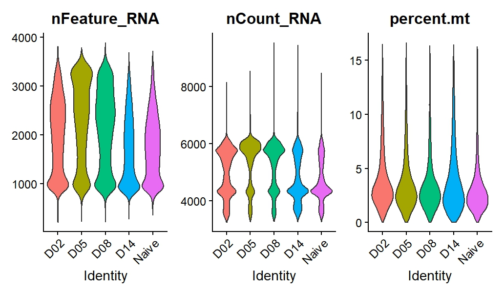
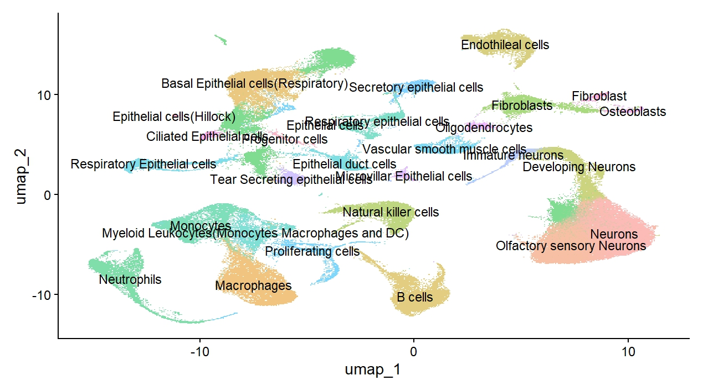
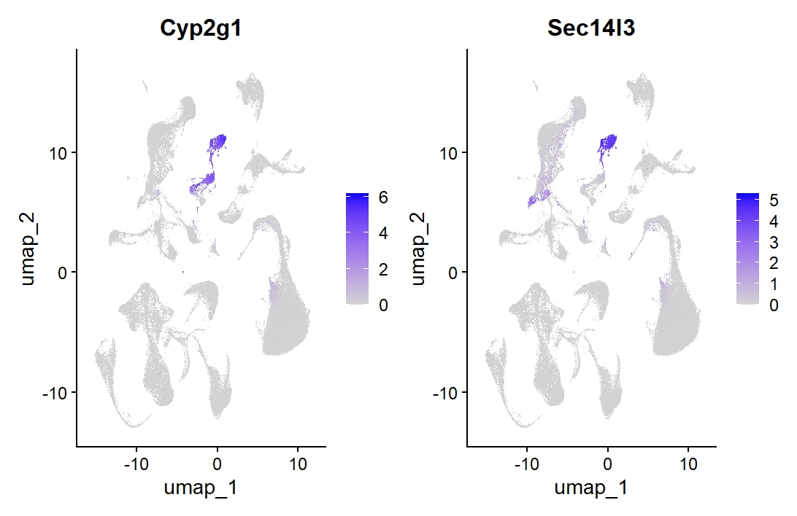
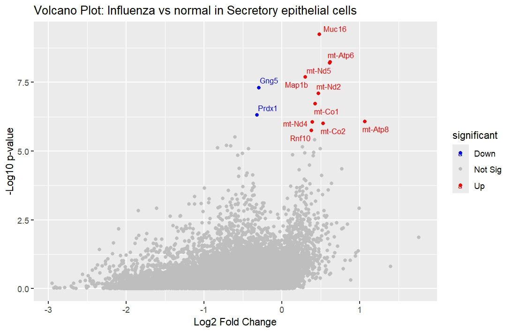
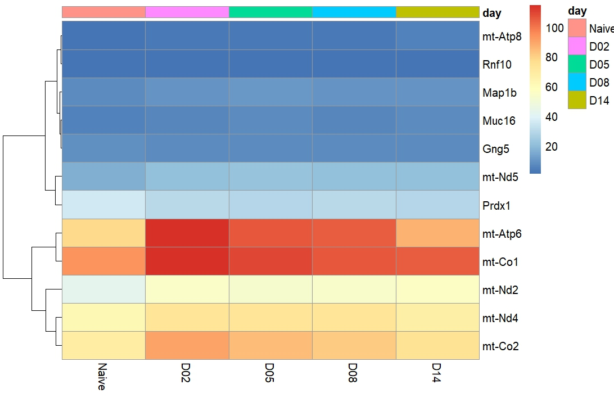
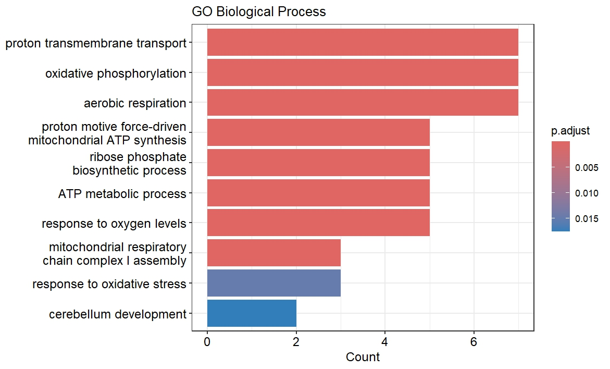
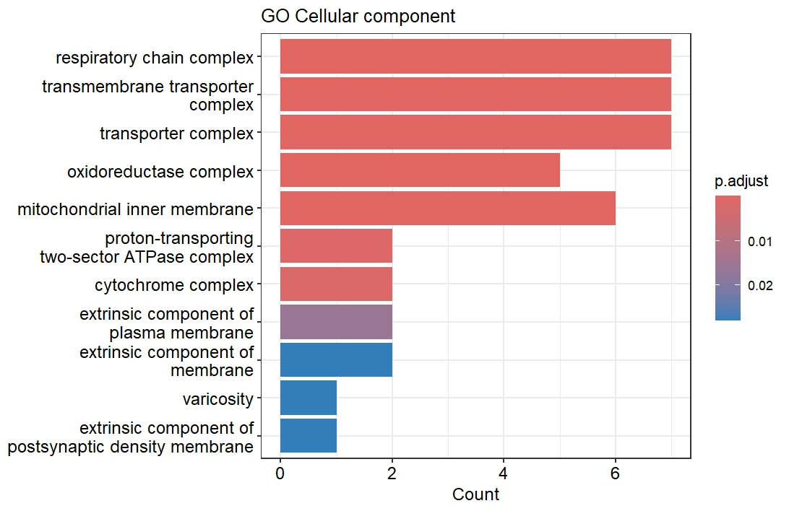
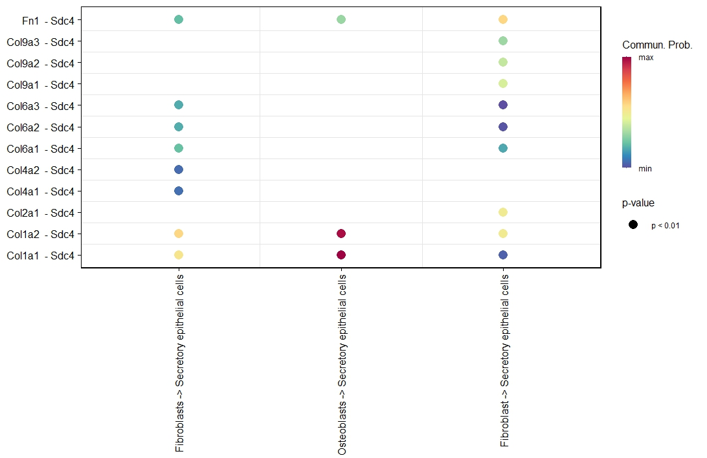

# Analysis of single-cell RNA-seq (scRNA-seq) data to investigate the effects of influenza infection on the mouse respiratory tract

## Biological Background

Single cell Transcriptomics(scRNA-seq)is the process of measuring the gene expression of many individual cells within a tissue population to study their functions, unique identities and interactions within the tissue (What Is Single Cell Transcriptomics? - Single Cell Discoveries, n.d.). The purpose of this project is to research the best methods, packages, and parameters for single cell gene expression analysis, cluster and annotate and perform differential expression of specific cell types to study the effects of the Influenza virus on these cells.

The Influenza virus refers to a family of contagious viruses collectively referred to as Orthomyxoviridae, they affect a wide range of animals from birds to other mammals and humans often leading to respiratory illnesses characterized by fever, cough, fatigue, and muscle aches, often leading to pneumonia or severe system illness (Bouvier & Palese, 2008; Short et al., 2015).

Influenza infection affects multiple cell types within the respiratory tract, leading to cellular damage, tissue disruption, and systemic consequences for the host. Understanding how different cell populations respond to infection is essential for characterizing disease pathology and identifying targets for more effective therapeutic strategies.

One of the cell types that could be interesting to study would be the secretory epithelial cells on the surface of the respiratory tract since they primary site of viral attachment, replication, and host defense, they determine the transmission severity and immune response to the virus (Denney & Ho, 2018). 

To investigate these effects at high resolution, single-cell transcriptomic data provides a powerful approach to capture cell-type-specific responses. However, extracting meaningful insights from such data requires the use of appropriate analytical tools and computational frameworks to ensure accurate identification of cell populations, differential responses, and intercellular communication patterns.

## Method comparison
Seurat is widely regarded as a leading framework for single-cell RNA sequencing (scRNA-seq) analysis due to its comprehensive end-to-end workflow. It enables preprocessing steps such as quality control, normalization, scaling, and dimensionality reduction, followed by clustering and visualization of distinct cell populations. In this analysis, Seurat is preferred over alternatives such as Scanpy because the dataset is of moderate size, making computational efficiency less of a limiting factor. Additionally, Seurat’s integration within the R ecosystem facilitates compatibility with downstream tools required for further analysis (Zhang et al., 2024).

A benchmarking study conducted in 2021 comparing single-cell annotation tools found that Seurat, SingleR, CP, SingleCellNet, and RPC performed well overall in terms of annotation accuracy. Notably, SingleR demonstrated increased robustness when distinguishing between highly similar cell types (Huang et al., 2021). This makes SingleR particularly suitable for this study, where subtle transcriptional differences between closely related cell populations are expected.

For differential gene expression analysis, multiple methods have been evaluated across metrics such as false discovery rate (FDR), sensitivity, specificity, and area under the curve (AUC). Recent comparative studies indicate that DESeq2 performs consistently well across these metrics, particularly in maintaining a balance between sensitivity and false discovery control (Li et al., 2026). As such, DESeq2 is selected as a reliable method for identifying differentially expressed genes in this analysis.

Finally, in order to compare Cell-Cell communications between our cells of interest and other cells, CellChat is preferred due to its comprehensive visualization and its ability to identify condition specific interactions across cells (Jin et al., 2024). 

# Methods
## Data Acquisition

The dataset used in this study was obtained from a previously published study available on the NCBI database (PMC11324402). It comprises single-cell RNA sequencing data generated from mouse respiratory tissues, including the respiratory mucosa, olfactory mucosa, and lateral nasal gland. Samples were collected from three mice at multiple time points during influenza infection, enabling the analysis of temporal changes in cellular responses.
Cell calling and initial preprocessing were performed prior to data distribution for this assignment by the course instructor. The processed data was provided as a Seurat object and used directly for downstream analysis within the R environment.

## Quality control
Quality control filtering was performed to remove low-quality and potentially damaged cells prior to downstream analysis. Cells with fewer than 200 detected genes (nFeature_RNA < 200) were excluded to eliminate likely empty droplets or low-complexity libraries. Additionally, cells with a high proportion of mitochondrial gene expression (percent.mt > 20%) were removed, as this is indicative of cellular stress or apoptosis.

This filtering step ensured that only high-quality cells with sufficient transcriptomic information were retained for subsequent normalization, clustering, and downstream analyses.

## Normalization and Scaling  
The filtered dataset was normalized and scaled using the `NormalizeData()` and `ScaleData()` functions from Seurat (v5.4.0), respectively. Log-normalization was applied to account for differences in sequencing depth across cells, ensuring comparability of gene expression values (Hao et al., 2023).

## Clustering  
Cell clustering was performed using the `FindClusters()` function from Seurat (v5.4.0). A resolution of 0.5 was selected to achieve a balance between cluster granularity and interpretability, allowing for the identification of distinct cell populations, including less abundant cell types (Hao et al., 2023).

## Automatic Annotation  
Automated cell type annotation was carried out using SingleR (v2.10.0). Cluster expression profiles were compared against curated mouse reference datasets, including ImmGen and MouseRNAseq, to assign cell identities and improve classification accuracy.

## Manual Annotation  
To validate and refine automated annotations, marker genes for each cluster were identified using the `FindAllMarkers()` function in Seurat. The top differentially expressed genes were cross-referenced with published literature and publicly available databases to infer cell type identities. This step was used to resolve discrepancies and improve annotation reliability (Hao et al., 2023).

## Differential Expression  
Pseudobulk aggregation was performed using the `AggregateExpression()` function, grouping cells by disease status, sample identity, and cell type (cluster). Secretory epithelial cells were selected as the cell type of interest. Differential gene expression analysis between influenza-infected and control samples was conducted using DESeq2 (v1.48.2), which models count data to identify significantly altered genes (Love et al., 2014).

## Overrepresentation Analysis (ORA)  
Gene Ontology (GO) overrepresentation analysis was conducted to identify enriched biological processes and cellular components associated with the differentially expressed genes. This analysis was performed using clusterProfiler (v4.16.0) (Xu et al., 2024). The following parameters were applied:

- **OrgDb** = org.Mm.eg.db (mouse annotation database)  
- **pAdjustMethod** = "BH" (Benjamini–Hochberg false discovery rate correction)  
- **pvalueCutoff** = 0.05  
- **qvalueCutoff** = 0.2  

## Cell–Cell Communication  
Cell–cell communication (CCC) analysis was performed using CellChat (v1.6.1) to investigate signaling interactions between secretory epithelial cells and neighboring cell populations. This approach enabled the identification of potential ligand–receptor interactions and signaling pathways involved in the cellular response to influenza infection (Jin, 2026).

The full R script used for this analysis can be found in [ScRNA-seq script](Seurat.R).

# Results
## Quality Control
Quality control filtering was performed to remove low-quality cells from the single-cell RNA sequencing dataset. Cells expressing fewer than 200 genes (nFeature_RNA) and those with mitochondrial gene content exceeding 20% (percent.mt) were excluded, as high mitochondrial expression may indicate cellular stress or apoptosis. The violin plots in Figure 1 demonstrate successful quality control filtering across all time points (D02, D05, D08, D14) and Naive samples. Post-filtering, the majority of cells across all sample identities display nFeature_RNA values ranging from approximately 1,000 to 3,500 genes, with corresponding nCount_RNA values predominantly between 4,000 and 8,000 UMIs. Notably, mitochondrial gene percentages are well-contained below the 20% threshold, with most cells exhibiting less than 10% mitochondrial content. The D14 sample shows a slightly narrower distribution in both nFeature_RNA and nCount_RNA compared to other time points, while the Naive sample displays the greatest variability in gene detection. These results indicate that the filtering parameters successfully retained high-quality cells suitable for downstream analysis while removing potentially compromised cells.

Figure 1 Quality control metrics of single-cell RNA sequencing data across experimental time points. Violin plots displaying the distribution of three key QC metrics for cells grouped by infection time points (D02, D05, D08, D14, and Naive). (Left) nFeature_RNA: number of unique genes detected per cell. (Center) nCount_RNA: total number of RNA molecules (UMI counts) per cell. (Right) percent.mt: percentage of mitochondrial gene expression per cell. The width of each violin represents the density of cells at each value. 

## Clustering and annotation
Dimensionality reduction using Uniform Manifold Approximation and Projection (UMAP) successfully resolved the single-cell transcriptomic data into 37 distinct cell clusters . Through a combination of manual and automated annotation approaches, each cluster was assigned a cell type identity. While the analysis revealed a diverse array of specialized cell populations, these broadly fell into five major cellular lineages: epithelial cells, immune cells, nerve cells, endothelial cells, and fibroblasts. Epithelial cell populations were the most heterogeneous, comprising multiple subtypes including basal, ciliated, secretory, and respiratory epithelial cells. The immune compartment encompassed both myeloid lineage cells  and lymphoid populations. Neuronal clusters included mature neurons, developing neurons, and specialized olfactory sensory neurons. Stromal populations were represented by distinct fibroblast clusters and osteoblasts, while vascular cell types included endothelial cells and vascular smooth muscle cells. Notably, the spatial organization of clusters in UMAP space reflected biological relationships, with similar cell types—such as immune populations and neuronal subtypes—positioned in close proximity to one another.

Figure 2. UMAP visualization of single-cell transcriptomic data revealing 37 distinct cell clusters. 
UMAP dimensionality reduction of single-cell RNA sequencing data, with each point representing an individual cell colored by cluster identity. Cell type annotations are indicated by text labels. The analysis reveals diverse cell populations spanning multiple lineages, including epithelial cells , immune cells , neuronal populations , stromal cells (fibroblasts and osteoblasts), and other cell types such as endothelial cells, oligodendrocytes, and vascular smooth muscle cells. Spatial proximity of clusters in UMAP space reflects transcriptional similarity between cell populations, with functionally related cell types clustering together.

## Feature Plots 
Feature plots were made using top identifier genes to identify the secretory epithelial cells which were the cell type of major interest for this analysis. Some top identifier genes Cyp2g1 and Sec14l3 demonstrated highly specific and robust expression within the secretory epithelial cell population. Both markers exhibited strong co-localization, with elevated expression  confined to distinct clusters in the upper region of the UMAP embedding, confirming the identity and clear transcriptional distinction of secretory epithelial cells from other cell populations in the dataset. 

Figure 3. Feature plots displaying expression of secretory epithelial cell marker genes. UMAP projections overlaid with normalized expression values for Cyp2g1 (left) and Sec14l3 (right), two top identifier genes for secretory epithelial cells. Color intensity represents log-normalized gene expression levels, ranging from grey (no/low expression) to purple(high expression). Both markers demonstrate highly specific expression patterns localized to secretory epithelial cell clusters, validating the annotation of this cell population of interest. Expression scales are shown to the right of each plot.

## Differential expression
Differential expression analysis was performed using DESeq2 to compare gene expression profiles between influenza-infected and naïve secretory epithelial cells. This analysis identified 12 genes with statistically significant differential expression, of which 10 were upregulated and 2 were downregulated in response to infection. Among the upregulated genes, Muc16 emerged as the most significantly differentially expressed gene, exhibiting both a high fold change and the lowest adjusted p-value. Notably, several mitochondrial-encoded genes, including mt-Atp6, mt-Co1, mt-Co2, mt-Nd2, mt-Nd4, and mt-Nd5, were significantly upregulated, suggesting altered mitochondrial activity during infection. Additional upregulated genes included Map1b, Rnf10, and mt-Atp8. In contrast, Gng5 and Prdx1 were the only significantly downregulated genes identified. Temporal analysis of gene expression across the course of infection revealed dynamic changes in the expression of these differentially expressed genes. The majority of genes demonstrated progressive increases in expression following infection, with mt-Atp6 and mt-Co1 exhibiting particularly pronounced upregulation. Expression of these mitochondrial genes peaked at day 2 post-infection, coinciding with the previously characterized peak of viral load, before gradually declining through days 5, 8, and 14. This temporal pattern suggests that mitochondrial metabolic reprogramming may be a key feature of the cellular response during acute influenza infection in secretory epithelial cells.

Figure 4. Volcano plot of differentially expressed genes between influenza-infected and naïve secretory epithelial cells. Differential expression analysis was performed using DESeq2, with each point representing a gene. The x-axis displays log2 fold change, and the y-axis shows the −log10 adjusted p-value. Significantly upregulated genes (n=10) are shown in red, significantly downregulated genes (n=2) are shown in blue, and non-significant genes are shown in grey. Key differentially expressed genes are labeled, with Muc16 identified as the most statistically significant upregulated gene.

Figure 5. Heatmap showing temporal expression patterns of differentially expressed genes across influenza infection. Heatmap displaying scaled expression values of the 12 significantly differentially expressed genes in secretory epithelial cells across the infection time course: naïve (uninfected), day 2 (D02), day 5 (D05), day 8 (D08), and day 14 (D14) post-infection. Color intensity represents relative expression levels, with warmer colors (red/orange) indicating higher expression and cooler colors (blue) indicating lower expression. Mitochondrial genes mt-Atp6 and mt-Co1 demonstrate peak expression at day 2 post-infection, corresponding to the timepoint of maximum viral load, with expression subsequently declining during the resolution phase of infection.

## Overrepresentation Analysis
To gain functional insight into the biological significance of the differentially expressed genes identified in influenza-infected secretory epithelial cells, Gene Ontology (GO) overrepresentation analysis (ORA) was performed . Analysis of enriched biological processes revealed a dominance of terms related to mitochondrial energy metabolism and cellular respiration. The most significantly enriched processes included proton transmembrane transport, oxidative phosphorylation, and aerobic respiration, each with seven associated genes from the input list  of 12 genes . Additional highly enriched processes included ATP metabolic process and ribose phosphate biosynthetic process. Notably, terms related to cellular stress responses were also enriched, including response to oxygen levels and response to oxidative stress, suggesting that infected secretory epithelial cells experience metabolic and oxidative challenges during influenza infection. Complementary analysis of GO Cellular Component terms further supported the central role of mitochondrial dysfunction in the host response to infection. The most significantly enriched cellular components were the respiratory chain complex, transmembrane transporter complex, and transporter complex, each represented by seven genes. Collectively, these findings indicate that influenza infection induces substantial alterations in mitochondrial function and cellular energy metabolism in secretory epithelial cells, potentially reflecting increased energy demands during the antiviral response or virus-induced mitochondrial stress.

Figure 6. Gene Ontology Biological Process enrichment analysis of differentially expressed genes in influenza-infected secretory epithelial cells. Bar plot displaying significantly enriched GO Biological Process terms identified through overrepresentation analysis. The x-axis represents the number of differentially expressed genes (count) associated with each term, while the y-axis lists the enriched biological processes. Bar color indicates the adjusted p-value , with red denoting higher statistical significance (p.adjust < 0.005) and blue indicating lower significance. The analysis reveals strong enrichment of terms related to mitochondrial function, including proton transmembrane transport, oxidative phosphorylation, aerobic respiration, and ATP synthesis, as well as stress response pathways such as response to oxygen levels and response to oxidative stress.

Figure 7. Gene Ontology Cellular Component enrichment analysis of differentially expressed genes in influenza-infected secretory epithelial cells. Bar plot showing significantly enriched GO Cellular Component terms from overrepresentation analysis of differentially expressed genes. The x-axis represents gene count, and the y-axis lists enriched cellular component terms. Bar color reflects adjusted p-value, with red indicating higher significance (p.adjust < 0.01) and blue indicating comparatively lower significance. The most highly enriched components are associated with mitochondrial structures and function, including the respiratory chain complex, transmembrane transporter complex, mitochondrial inner membrane, oxidoreductase complex, and cytochrome complex, consistent with the observed upregulation of mitochondrial-encoded genes during infection.
## Cell Cell Communication 
Cell-cell communication analysis was performed to investigate ligand-receptor interactions between secretory epithelial cells and neighboring cell populations within the dataset. The analysis revealed significant extracellular matrix (ECM)-mediated signaling between stromal cells and secretory epithelial cells, primarily through collagen-Syndecan-4 (Sdc4) interactions. Among the identified interactions, Col1a1-Sdc4 and Col1a2-Sdc4 exhibited the highest communication probability scores, with osteoblasts and fibroblasts serving as the primary sender populations signaling to secretory epithelial cells. Additional collagen family members were also predicted to interact with Sdc4 on secretory epithelial cells. These findings suggest that ECM remodeling and stromal-epithelial crosstalk may play an important role in modulating secretory epithelial cell function.

Figure 8. Cell-cell communication analysis of collagen-Syndecan-4 interactions between stromal and secretory epithelial cells. Dot plot displaying predicted ligand-receptor interactions between fibroblasts, osteoblasts, and secretory epithelial cells. The y-axis lists collagen family ligands and Fibronectin (Fn1) paired with the Syndecan-4 (Sdc4) receptor. Dot color represents communication probability (blue = minimum, red = maximum), and all displayed interactions are statistically significant (p < 0.01). Col1a1-Sdc4 and Col1a2-Sdc4 interactions from osteoblasts demonstrated the strongest predicted signaling to secretory epithelial cells.
# Discussion
This analysis shows distinct cell types found within small tissue sections and how disease states can affect them. It shows how the effects are seen from the level of the molecular level with the ligands and receptors to the cellular components and the cells within the tissue itself. 

MUC16 gene was the top expressed gene seen in the analysis and is a  gene that encodes a large, membrane-tethered mucin (MUC16) that acts as part of the apical protective glycocalyx on respiratory epithelial cells. During infections this mucin works alongside secreted mucins (MUC5AC, MUC5B) and other membrane-tethered mucins (MUC1, MUC4) to form a barrier against pathogens. MUC16 is specifically expressed in tracheal surface epithelia, submucosal glands, goblet cells, and ciliated cells within the airway, directly linking it to secretory epithelial cell populations. This supports its increased expression in infected cell populations when compared to normal cell populations (Davies et al., 2007).

During influenza infection, host cells experience substantial metabolic reprogramming to meet the energetic demands of the antiviral response and, paradoxically, viral replication (Smallwood et al., 2017). Elevated mt-Atp6 expression at peak viral load (day 2) suggests that secretory epithelial cells upregulate oxidative phosphorylation machinery to compensate for virus-induced metabolic stress. Previous studies have demonstrated that influenza A virus (IAV) manipulates host cell mitochondrial function to facilitate replication, with increased ATP production required to support viral protein synthesis and genome replication (Ohta & Nishiyama, 2011). Furthermore, mitochondrial dysfunction has been implicated in influenza pathogenesis in airway epithelial cells, potentially contributing to cell death and tissue damage (Piantadosi & Suliman, 2017).

The observed upregulation of mt-Co1 directly corresponds to the enriched GO Cellular Component terms respiratory chain complex. mt-Co1 encodes the central catalytic subunit of cytochrome c oxidase (Complex IV), the terminal enzyme of the mitochondrial electron transport chain responsible for transferring electrons to molecular oxygen during aerobic respiration (Fontanesi et al., 2006). The peak expression of mt-Co1 at day 2 post-infection coincides with the enriched Biological Process term "aerobic respiration" and suggests heightened mitochondrial respiratory activity during acute influenza infection.

The upregulation of mt-Nd2 and mt-Nd4 is consistent with the enriched GO terms "mitochondrial respiratory chain complex I assembly," "oxidative phosphorylation," and "mitochondrial inner membrane." These genes encode essential subunits of NADH:ubiquinone oxidoreductase (Complex I), the largest complex of the electron transport chain that catalyzes the first step of oxidative phosphorylation by transferring electrons from NADH to ubiquinone (Bridges et al., 2010). Complex I is also a major site of mitochondrial ROS production, linking its upregulation to the observed enrichment of "response to oxygen levels" and "response to oxidative stress" in our analysis. In the context of influenza infection, Complex I activity has been shown to be modulated by viral proteins, with the IAV PB1-F2 protein reported to localize to mitochondria and disrupt mitochondrial membrane potential (Yoshizumi et al., 2014). The increased expression of mt-Nd2 and mt-Nd4 in secretory epithelial cells may represent a compensatory response to maintain cellular energy homeostasis in the face of virus-induced mitochondrial perturbation. 

The cell-cell communication analysis revealed significant interactions between stromal cell populations (fibroblasts and osteoblasts) and secretory epithelial cells, primarily mediated through collagen-Syndecan-4 (Sdc4) signaling. Syndecan-4 is a transmembrane  proteoglycan that serves as a co-receptor for extracellular matrix (ECM) components and plays critical roles in cell adhesion, migration, and mechanotransduction (Elfenbein & Bhatt, 2013). The identification of Col1a1-Sdc4 and Col1a2-Sdc4 as the interactions with highest communication probability is particularly relevant in the context of influenza infection, as type I collagen is the predominant structural protein of the lung interstitium and basement membrane (Burgess et al., 2016).

During respiratory viral infections, ECM remodeling is a hallmark feature of the tissue response, involving both degradation and deposition of matrix components (Boyd et al., 2020). Fibroblasts are the primary producers of collagen in the lung and become activated during inflammation to facilitate tissue repair (Kendall & Bhatt, 2015). The strong collagen-Sdc4 signaling from fibroblasts and osteoblasts to secretory epithelial cells suggests active stromal-epithelial crosstalk that may serve to maintain epithelial barrier integrity or promote repair following virus-induced damage. Syndecan-4 engagement by collagens can activate intracellular signaling cascades, including focal adhesion kinase (FAK) and protein kinase C (PKC) pathways, which regulate cell survival, proliferation, and cytoskeletal organization (Afratis et al., 2017).
The communication between stromal cells and secretory epithelial cells through these collagen subtypes suggests coordinated efforts to preserve basement membrane integrity and support epithelial homeostasis during the inflammatory response to influenza infection.

## Conclusion
This single-cell transcriptomic analysis of influenza-infected secretory epithelial cells reveals a coordinated cellular response characterized by profound mitochondrial metabolic reprogramming and dynamic stromal-epithelial interactions. Differential expression analysis identified 12 significantly altered genes, predominantly mitochondrial-encoded components of the electron transport chain and ATP synthase, with peak expression coinciding with maximum viral load at day 2 post-infection. Gene Ontology enrichment analysis confirmed that these genes are functionally linked to oxidative phosphorylation, aerobic respiration, proton transport, and cellular stress responses, indicating that secretory epithelial cells undergo substantial bioenergetic adaptations to meet the metabolic demands of the antiviral response. The concurrent upregulation of Muc16, encoding a critical mucin glycoprotein, alongside mitochondrial genes suggests a functional coupling between enhanced energy production and mucin secretion—a key innate defense mechanism in the respiratory epithelium.

Collectively, our findings underscore the central role of mitochondrial function and intercellular communication in shaping the secretory epithelial cell response to influenza infection, identifying potential therapeutic targets for mitigating respiratory viral pathogenesis. Future studies investigating the functional consequences of these metabolic and signaling alterations may provide further insight into strategies for enhancing epithelial resilience during respiratory infections.

# References

Aran D, Looney AP, Liu L, Wu E, Fong V, Hsu A, Chak S, Naikawadi RP,
Wolters PJ, Abate AR, Butte AJ, Bhattacharya M (2019). “Reference-based
analysis of lung single-cell sequencing reveals a transitional profibrotic macrophage.” _Nat. Immunol._, *20*, 163-172. doi:10.1038/s41590-018-0276-y
  
Bouvier, N. M., & Palese, P. (2008). THE BIOLOGY OF INFLUENZA VIRUSES. Vaccine, 26(Suppl 4), D49. https://doi.org/10.1016/J.VACCINE.2008.07.039

Bridges, H. R., Bill, E., & Hirst, J. (2010). Mössbauer spectroscopy on respiratory complex I: the iron–sulfur cluster ensemble in the NADH-reduced enzyme is partially oxidized. Biochemistry, 51(1), 149-158.

Davies, J. R., Kirkham, S., Svitacheva, N., Thornton, D. J., & Carlstedt, I. (2007). MUC16 is produced in tracheal surface epithelium and submucosal glands and is present in secretions from normal human airway and cultured bronchial epithelial cells. International Journal of Biochemistry and Cell Biology, 39(10), 1943–1954. https://doi.org/10.1016/j.biocel.2007.05.013

Denney, L., & Ho, L. P. (2018). The role of respiratory epithelium in host defence against influenza virus infection. Biomedical Journal, 41(4), 218. https://doi.org/10.1016/J.BJ.2018.08.004

Fontanesi, F., Soto, I. C., Horn, D., & Barrientos, A. (2006). Assembly of mitochondrial cytochrome c-oxidase, a complicated and highly regulated cellular process. American Journal of Physiology-Cell Physiology, 291(6), C1129-C1147.

Hao et al. Dictionary learning for integrative, multimodal and scalable
  single-cell analysis. Nature Biotechnology (2023) [Seurat V5]

Huang, Q., Liu, Y., Du, Y., & Garmire, L. X. (2021). Evaluation of Cell Type Annotation R Packages on Single-cell RNA-seq Data. Genomics, Proteomics & Bioinformatics, 19(2), 267–281. https://doi.org/10.1016/J.GPB.2020.07.004

Jin, S., Plikus, M. V., & Nie, Q. (2024). CellChat for systematic analysis of cell–cell communication from single-cell transcriptomics. Nature Protocols 2024 20:1, 20(1), 180–219. https://doi.org/10.1038/s41596-024-01045-4

Jin S (2026). _CellChat: Inference and analysis of cell-cell communication from single-cell and spatial transcriptomics data_. R package version 1.6.1

Li, D., Liu, P., Rahman, I., Zand, M., Pryhuber, G., Dye, T., Goniewicz, M., Gurkar, A. U., Königshoff, M., Eickelberg, O., Mora, A., Rojas, M., Ma, Q., Lugo-Martinez, J., Bar-Joseph, Z., Lanna, S., Finkel, T., & Xie, Z. (2026). Evaluation of statistical differential analysis methods for identification of senescent cells using single-cell transcriptomics. Cell Reports Methods, 6(2), 101264. https://doi.org/10.1016/J.CRMETH.2025.101264

Love, M.I., Huber, W., Anders, S.(2014). Moderated estimation of fold change and dispersion for RNA-seq data with DESeq2 Genome Biology 15(12):550. 

Piantadosi, C. A., & Suliman, H. B. (2017). Mitochondrial dysfunction in lung pathogenesis. Annual Review of Physiology, 79, 495-515.

Short, K. R., Richard, M., Verhagen, J. H., van Riel, D., Schrauwen, E. J. A., van den Brand, J. M. A., Mänz, B., Bodewes, R., & Herfst, S. (2015). One health, multiple challenges: The inter-species transmission of influenza A virus. One Health, 1, 1. https://doi.org/10.1016/J.ONEHLT.2015.03.001

What is Single Cell Transcriptomics? - Single Cell Discoveries. (n.d.). Retrieved April 12, 2026, from https://www.scdiscoveries.com/blog/knowledge/single-cell-transcriptomics/

S Xu, E Hu, Y Cai, Z Xie, X Luo, L Zhan, W Tang, Q Wang, B Liu, R Wang,W Xie, T Wu, L Xie, G Yu. Using clusterProfiler to characterize multiomics data. Nature Protocols. 2024, 19(11):3292-3320

Smallwood, H. S., Duan, S., Morfouace, M., Rezinciuc, S., Shulkin, B. L., Shelat, A., ... & Thomas, P. G. (2017). Targeting metabolic reprogramming by influenza infection for therapeutic intervention. Cell Reports, 19(8), 1640-1653.

Yoshizumi, T., Ichinohe, T., Sasaki, O., Otera, H., Kawabata, S. I., Mihara, K., & Koshiba, T. (2014). Influenza A virus protein PB1-F2 translocates into mitochondria via Tom40 channels and impairs innate immunity. Nature Communications, 5(1), 4713.

Zhang, H., Zhang, W., Zhao, S., Xu, G., Shen, Y., Jiang, F., Qin, A., & Cui, L. (2024). easySCF: a tool for enhancing interoperability between R and Python for efficient single-cell data analysis. Bioinformatics, 40(12). https://doi.org/10.1093/BIOINFORMATICS/BTAE710
